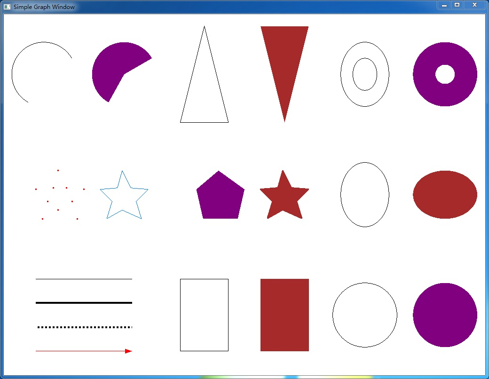

# Introduction

Graph2D is a simple 2D graph library to assist programmers to develop basic graph program using C++. Here is an example code of drawing a circle with text using Graph2D.
```C++
#include <Graph2D.h>
using namespace graph;

void display()
{
    circle(512, 384, 100);  
    putText(480, 384, "Hello world!");
}

int main(int argc, char *argv[])
{
    initGraph(display);
    return 0;
}
```
**Fig. 1** shows some basic graphs drawn by using Graph2D. The example can be found from the repo /examples/GraphElement.



**Fig.1** Basic graphs drawn by using Graph2D

# How to use

1. Please refer to **"Graph2DSpecificationV1.pdf"** to see the tutorial of Graph2D. 
2. Download **"install"** folder and refer to **"readme.txt"** to install the Graph2D.
3. Download **"examples"** floder to see the benchmark code written by Graph2D.

# Team members

  ***Shaojun Hu** <hsj@nwsuaf.edu.cn>

  ***Nan Geng** <nangeng@nwsuaf.edu.cn>


